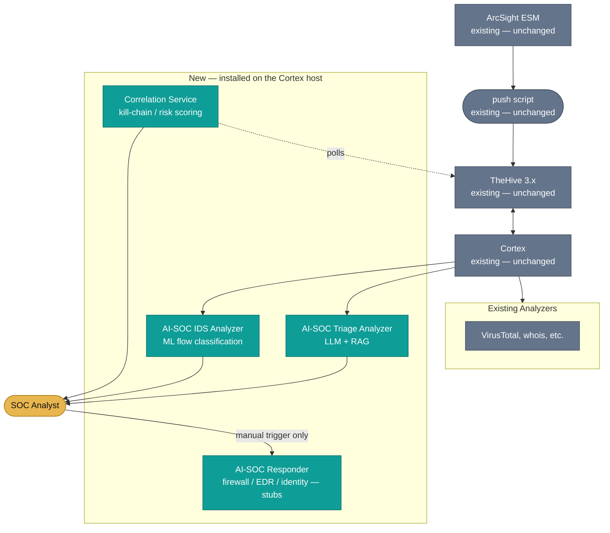

# AI-SOC for ArcSight + TheHive + Cortex

AI-assisted alert triage, ML-based classification, and analyst-approved response — delivered as native **Cortex Analyzers and a Responder**, running on top of the existing ArcSight ESM → TheHive 3.x → Cortex pipeline. No new SIEM, no new case-management system, no external AI API.

This is a variant of the main [AI-SOC](../README.md) project, re-targeted at an ArcSight/TheHive/Cortex environment instead of Wazuh.

## What This Is

- ArcSight ESM keeps generating and correlating alerts, and keeps pushing them into TheHive 3.x exactly like it does today (existing push script, untouched).
- Cortex keeps doing enrichment exactly like it does today (existing analyzers, untouched).
- This project adds three things *on top*, all installed on the existing Cortex host:
  - **AI-SOC Triage Analyzer** — LLM-based severity/MITRE assessment with RAG context, callable on any observable/case the same way analysts already run Cortex analyzers.
  - **AI-SOC IDS Analyzer** — ML classification (BENIGN/ATTACK) for network-flow observables.
  - **AI-SOC Responder** — D3FEND-mapped response actions (firewall/EDR/identity), analyst-triggered only. No automatic execution, ever.
- A small **Correlation Service** polls TheHive's API for new/updated cases, builds a kill-chain/risk view across them, and writes it back as a case custom field or comment.

## Hard Requirement: No External AI

Every model call stays inside the internal network. No OpenAI, no Anthropic, no hosted inference of any kind.

| Component | Role | Where it runs |
|---|---|---|
| Ollama (`llama3.1:8b`) | Local LLM for triage | Cortex host |
| ChromaDB | Local vector store — MITRE ATT&CK, CVE, runbooks | Cortex host |
| Random Forest / XGBoost / Decision Tree | Local ML models for flow classification | Cortex host |

## Architecture

## Status

| Component | Status | Notes |
|---|---|---|
| AI-SOC Triage Analyzer | Planned | Adapts `alert-triage` + `rag-service` from the main AI-SOC project into a single Cortex analyzer |
| AI-SOC IDS Analyzer | Planned | Adapts `ml_training/inference_api.py` |
| Correlation Service | Planned | Adapts `correlation-engine`; polls TheHive 3.x API today, webhook-ready for a future TheHive 4/5 upgrade |
| AI-SOC Responder | Planned | Adapts `response-orchestrator`'s D3FEND mapping; firewall/EDR/identity adapters remain stubs until real vendor integrations are wired in |
| ArcSight → TheHive bridge | Not needed | Existing push script already handles this |

## Environment

- TheHive 3.x, Cortex (existing) — no version changes required
- Host: 32GB RAM, CPU-only (no GPU) — same host as Cortex
- Alert volume: ~80/day — Correlation Service polls TheHive every 1-2 minutes with comfortable headroom
- Expected LLM triage latency: ~1-2 minutes per alert on CPU inference — acceptable for background enrichment, not a live chat path

## Open Items

- ArcSight ESM alert volume and TheHive 3.x API rate limits — confirm before finalizing the Correlation Service polling interval
- Per-analyst API keys for the Responder's manual-trigger authorization (mirrors the bootstrap-key limitation in the main AI-SOC project)
- TheHive 4/5 migration path — not required now, but the Correlation Service's event source is built pluggable so a future upgrade doesn't require a rewrite

## Relationship to the Main AI-SOC Project

This is not a fork — it reuses the same local AI substrate (Ollama, ChromaDB, ML models) and the same core logic (triage prompting, D3FEND mapping, kill-chain correlation) as [../README.md](../README.md), repackaged as Cortex extensions instead of standalone FastAPI microservices. Fixes and model improvements made in one should be ported to the other where they apply.
